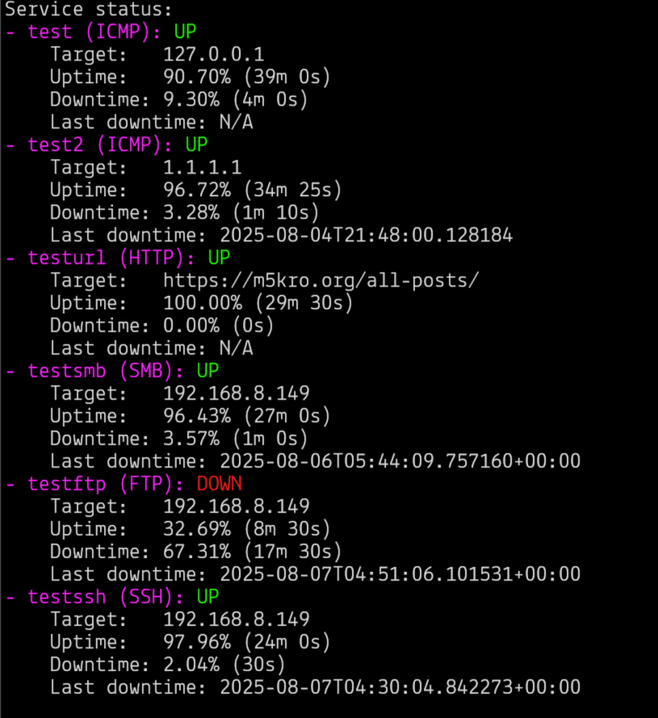

# tum
tum stands for terminal uptime monitor. Linux and MacOS are supported.<br>
<br>
tum works in the background and periodically connects to different services to see if they are still up and working.<br>
It currently does `ICMP`, `HTTP`, `SMB`, `FTP`, and `SSH` monitoring.<br>
<br>
Example:<br>


# Install
### Linux
Here is a one line installer for tum:<br>
`curl -fsSL https://raw.githubusercontent.com/m5kro/tum/refs/heads/main/install.sh | bash`<br>
<br>
To uninstall (may need root):<br>
`rm -rf /usr/local/bin/tum && rm -rf /usr/local/share/tum`

### MacOS
Please refer to the build section, as I don't provide MacOS builds.

## How to Use
```
Usage: tum [options]
Options:
  -h, --help               Show this help message and exit
  -c, --config             Show the current configuration
  -v, --version            Show the version of tum
  -a, --add <name>         Add a new service to monitor (requires -t/--target and -s/--service)
  -r, --remove <name>      Remove a service from monitoring
  -s, --service <type>     Specify the service type (ICMP/SMB/FTP/HTTP/SSH)
  -i, --interval <seconds> Set the monitoring interval (default: 60 seconds)
  -u, --username <name>    Set the username for the service (SMB/FTP/SSH)
  -P, --password <password> Set the password for the service (SMB/FTP/SSH)
  -p, --port <port>        Set the port for the service (uses sensible defaults if omitted)
  -t, --target <host>      Target hostname or IP address (required when adding)
  -d, --daemon <start|stop|status> Start, stop, or show status of the background daemon
Example:
  tum -a MyService -s ICMP -t 8.8.8.8 -i 30
  tum -a Web -s HTTP -t example.com -p 8080
  tum -d start
  tum -d status
```

## How to Build
If you would like to build tum for yourself or make any modifications, here's how to setup the development enviornment:<br>
1. Clone the GitHub Repo:<br>
`git clone https://github.com/m5kro/tum && cd tum`<br>
2. Create a python venv:<br>
`python3 -m venv venv`<br>
3. Activate the venv:<br>
`source venv/bin/activate`<br>
4. Install dependencies:<br>
`python3 -m pip install -r requirements.txt`<br>
5. Build the executable:<br>
`pyinstaller --name "tum" --onedir main.py`<br>
You will find the output in the `dist` folder.
